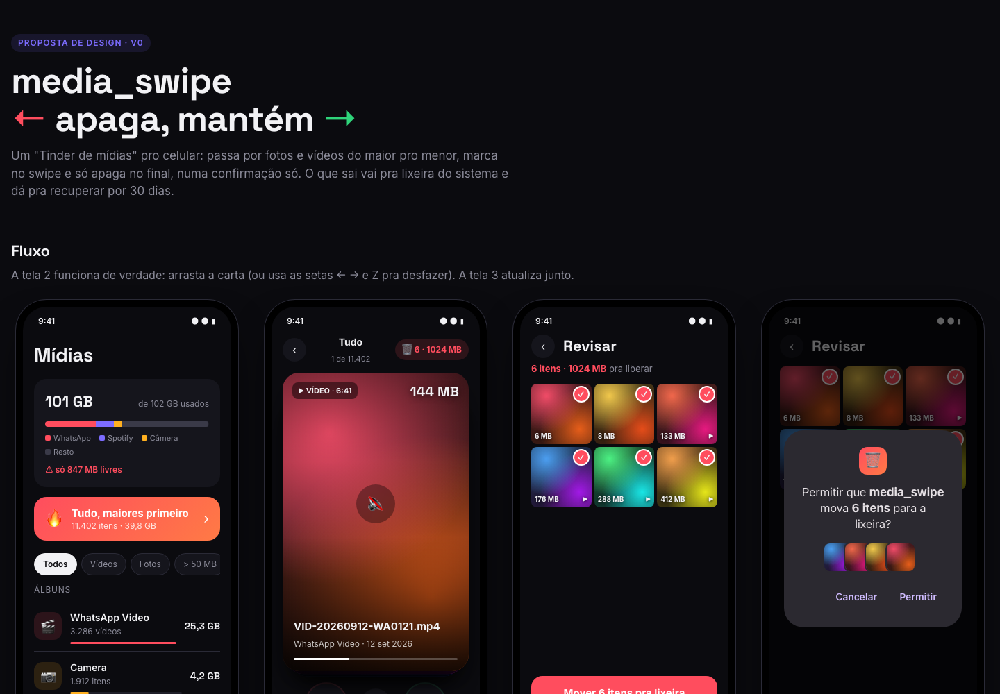

# media-delete-matcher

Um "Tinder de mídias" pra Android: passa pelas fotos e vídeos do celular **do maior pro menor**, decide no swipe e só apaga no final, numa confirmação só.

**← apaga · → mantém · ↑ comprime**


<sub>Protótipo inicial (`design.html`, com dados fictícios). O app evoluiu a partir dele.</sub>

## Por que existe

O celular encheu e a galeria não ajuda: mostra tudo misturado, do mais novo pro mais velho, e **esconde a mídia do WhatsApp** quando a "visibilidade de mídia" tá desligada, justo onde costuma estar a maior parte do espaço. Aqui a ordem é por tamanho, então os primeiros swipes são os que mais liberam espaço.

## O que faz

- **Swipe do maior pro menor**: vídeo toca mudo em loop (toque liga o som), a próxima carta já vem carregada e segurar abre em tela cheia com zoom
- **Filtros**: vídeos, fotos, maiores que 50 MB, por ano
- **Nada some sem confirmar**: tudo passa por uma revisão em grade e vai pra uma **lixeira do app** que guarda por 30 dias, com restaurar e esvaziar
- **Comprimir em vez de apagar**: swipe pra cima recodifica o vídeo em 720p no próprio celular. Só aparece quando compensa, e o original vai pra lixeira
- **Duplicados exatos**: acha o mesmo arquivo salvo mais de uma vez, byte a byte, e deixa ficar com uma cópia de cada
- **Painel de armazenamento**: quanto o celular tem e pra onde foi cada GB (WhatsApp, câmera, outras mídias, outros arquivos, apps e dados, sistema)
- **Mantidos**: rever o que foi mantido e voltar atrás

## Como funciona por dentro

Algumas decisões que valem a leitura:

**Lê o sistema de arquivos, não o MediaStore.** O MediaStore marca como "não é mídia" tudo que está numa pasta com `.nomedia`, então a galeria (e qualquer lib baseada nela) não enxerga os vídeos do WhatsApp. O app usa a permissão de acesso a todos os arquivos e varre o armazenamento direto num isolate ([`media_file.dart`](lib/media/media_file.dart)).

**Varredura incremental.** Criar, apagar ou renomear um arquivo muda a data da pasta. O app guarda um retrato de cada pasta e só relista as que mudaram; abre na hora com o cache e atualiza em segundo plano. Pasta mexida há menos de 2 s é sempre relistada, porque a data tem precisão de milissegundo.

**Duplicados num funil.** Ler os 30+ GB inteiros pra comparar seria lento demais. Então: agrupa por tamanho em bytes (grátis) → SHA-1 dos primeiros e últimos 64 KB → SHA-1 completo só de quem sobrou. Os hashes ficam em cache ([`duplicate_finder.dart`](lib/media/duplicate_finder.dart)).

**Compressão sem risco.** Com o [Media3 Transformer](https://developer.android.com/media/media3/transformer) (codec de hardware, sem ffmpeg): recodifica pra um temporário escondido; se não ficou pelo menos 15% menor, descarta; se ficou, o original vai pra lixeira do app e a versão leve assume o lugar com a mesma data ([`video_compressor.dart`](lib/media/video_compressor.dart)).

**Lixeira própria.** A lixeira do Android só aceita o que o MediaStore considera mídia. A do app é uma pasta escondida no mesmo volume, então mover pra lá é um `rename`, instantâneo, sem copiar nada ([`trash_bin.dart`](lib/media/trash_bin.dart)).

**Decisões em JSON com gravação agrupada.** Swipes seguidos viram uma gravação só, com escrita atômica (`.tmp` + rename), e grava na hora quando o app vai pro fundo ([`decision_store.dart`](lib/media/decision_store.dart)).

**Canal nativo pequeno.** O que o Dart não faz sozinho fica no [`MainActivity.kt`](android/app/src/main/kotlin/dev/gabrieloliveira/media_swipe/MainActivity.kt): permissão, miniaturas (`ThumbnailUtils`), espaço do aparelho (`StorageStatsManager`), metadados de vídeo e compressão.

## Estrutura

```
lib/
├── media/            # tudo que não é tela
│   ├── media_file.dart       # varredura do armazenamento + cache por pasta
│   ├── media_library.dart    # a biblioteca em memória, álbuns, filtros
│   ├── decision_store.dart   # marcados, mantidos, fila de compressão
│   ├── trash_bin.dart        # lixeira do app
│   ├── duplicate_finder.dart # funil de hash
│   ├── compression.dart      # quando vale comprimir e como
│   ├── video_compressor.dart # troca segura do arquivo
│   └── native_bridge.dart    # ponte pro Kotlin
├── screens/          # home, swipe, revisão, lixeira, duplicados, compressão...
└── widgets/          # carta do swipe, preview de mídia, miniatura
```

## Rodando

Precisa de Flutter **3.38.7** (fixado no `.fvmrc`) e de um Android **11 ou mais novo**.

```bash
fvm install          # ou use o Flutter 3.38.7 instalado
flutter pub get
flutter run          # com o celular conectado
flutter test         # testes de lógica (varredura, lixeira, hash, compressão...)
flutter build apk --release --target-platform android-arm64
```

Na primeira abertura o app explica e pede o **acesso a todos os arquivos**. Nada sai do celular: não tem internet, conta nem analytics.

## Limitações

- **Só Android**, e Android 11+. No iPhone não existe "ler o armazenamento".
- **Fora da Play Store**: o Google restringe a permissão de acesso a todos os arquivos pra apps comuns. Pra uso pessoal (APK direto) não muda nada.
- **"Apps e dados" no painel é estimado**: é o que sobra depois de descontar sistema e arquivos visíveis. Separar app por app exigiria outra permissão.
- **Compressão roda com o app aberto**, um vídeo por vez.
- Arquivos no cartão SD não entram na varredura.

## Licença

[MIT](LICENSE). As fontes [Inter](assets/fonts/OFL-Inter.txt) e [Space Grotesk](assets/fonts/OFL-SpaceGrotesk.txt) são OFL.
