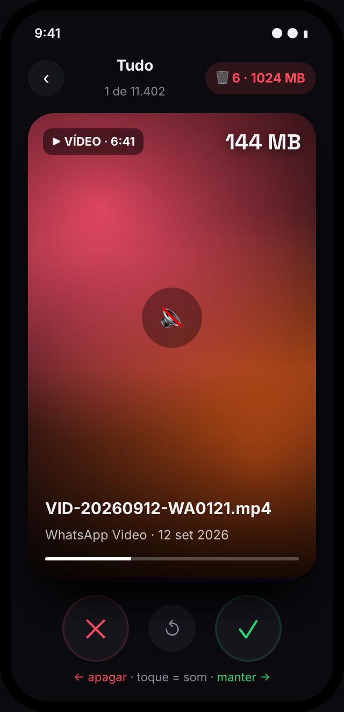
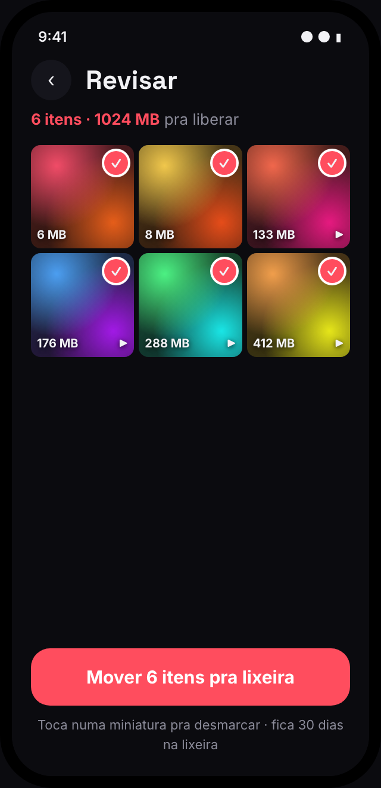
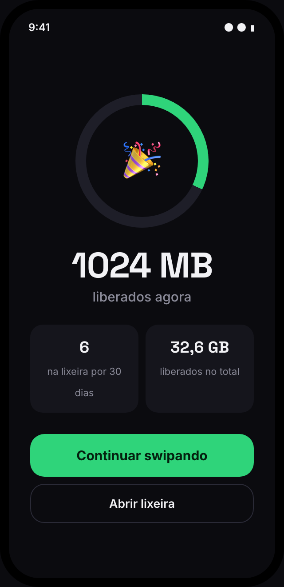
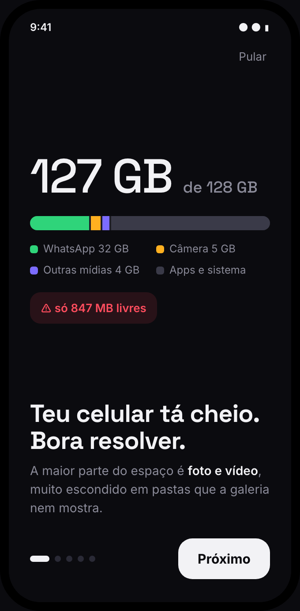
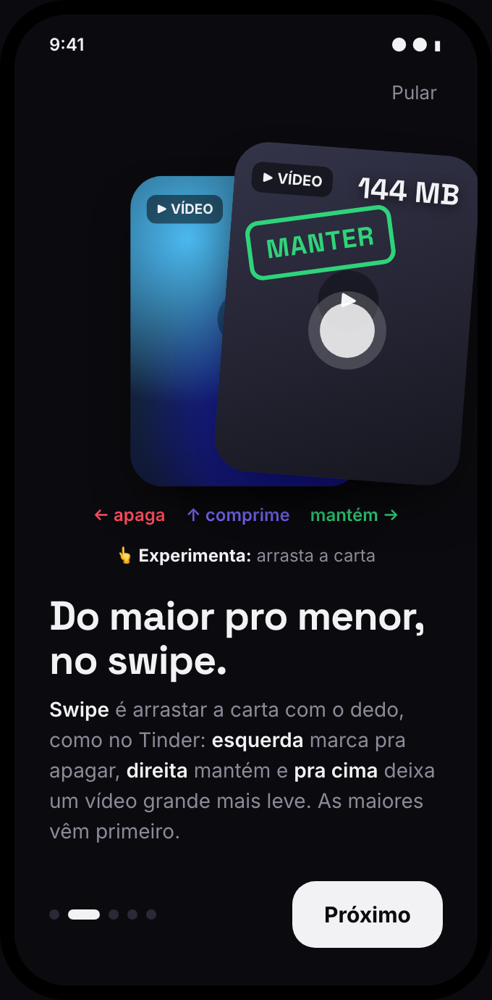
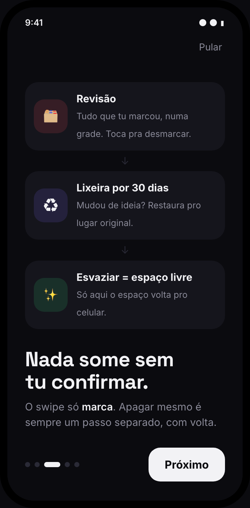
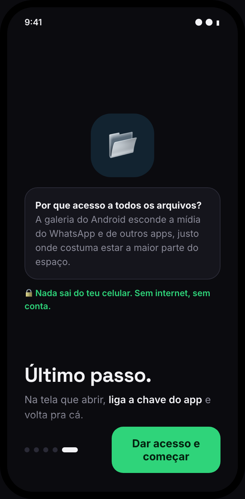

<div align="center">


<h1>Media Swipe</h1>

<p><b>Um "Tinder de mídias" pra Android.</b><br>
Passa pelas fotos e vídeos do celular <b>do maior pro menor</b>, decide no swipe<br>
e só apaga no final, numa confirmação só.</p>

<p>


</p>

<p>
<kbd>←</kbd> apaga &nbsp;·&nbsp; <kbd>→</kbd> mantém &nbsp;·&nbsp; <kbd>↑</kbd> comprime
</p>

</div>

<br>

<table align="center">
  <tr>
    <td align="center"><br><sub><b>Swipe</b><br>maiores primeiro</sub></td>
    <td align="center"><br><sub><b>Revisão</b><br>confirma tudo de uma vez</sub></td>
    <td align="center"><br><sub><b>Pronto</b><br>espaço liberado</sub></td>
  </tr>
</table>

<table align="center">
  <tr>
    <td align="center"><br><sub>O problema</sub></td>
    <td align="center"><br><sub>Como funciona</sub></td>
    <td align="center"><br><sub>Nada some sem confirmar</sub></td>
    <td align="center"><br><sub>A permissão, explicada</sub></td>
  </tr>
</table>

<p align="center"><sub>Imagens dos protótipos em HTML do repositório (<a href="design.html"><code>design.html</code></a> e <a href="onboarding.html"><code>onboarding.html</code></a>), com dados fictícios.</sub></p>

---

## Por que existe

O celular encheu e a galeria não ajuda: mostra tudo misturado, do mais novo pro mais velho, e **esconde a mídia do WhatsApp** quando a "visibilidade de mídia" tá desligada, justo onde costuma estar a maior parte do espaço.

O Media Swipe inverte a lógica: **ordena por tamanho**. Os primeiros swipes são os que mais liberam espaço, e decidir sobre um vídeo de 144 MB leva o mesmo segundo que decidir sobre uma foto de 200 KB.

No celular onde ele nasceu, a faxina foi de **847 MB livres pra 13 GB**.

## Como se usa

<table>
  <tr>
    <td width="40" align="center">1️⃣</td>
    <td><b>Escolhe por onde começar.</b> "Tudo, maiores primeiro", uma pasta específica, ou um filtro: só vídeos, maiores que 50 MB, de 2023...</td>
  </tr>
  <tr>
    <td align="center">2️⃣</td>
    <td><b>Swipe.</b> Esquerda marca pra apagar, direita mantém, pra cima manda um vídeo pesado pra fila de compressão. Segurar a carta abre em tela cheia com zoom. Desfazer tá sempre a um toque.</td>
  </tr>
  <tr>
    <td align="center">3️⃣</td>
    <td><b>Revisão.</b> Tudo que foi marcado aparece numa grade; toca pra desmarcar o que mudou de ideia.</td>
  </tr>
  <tr>
    <td align="center">4️⃣</td>
    <td><b>Lixeira.</b> O que sai fica 30 dias na lixeira do app, com restaurar. O espaço volta pro celular quando ela é esvaziada.</td>
  </tr>
</table>

## O que tem

<table>
  <tr>
    <td width="50%" valign="top">
      <h4>🔥 Swipe do maior pro menor</h4>
      Vídeo toca mudo em loop (toque liga o som), a próxima carta já vem carregada, vibração ao decidir.
    </td>
    <td width="50%" valign="top">
      <h4>📊 Painel de armazenamento</h4>
      Quanto o celular tem e pra onde foi cada GB: WhatsApp, câmera, outras mídias, outros arquivos, apps e dados, sistema.
    </td>
  </tr>
  <tr>
    <td valign="top">
      <h4>🗜️ Comprimir em vez de apagar</h4>
      Recodifica em 720p no próprio celular. Só aparece quando compensa; se não ficar bem menor, nada muda.
    </td>
    <td valign="top">
      <h4>⧉ Duplicados exatos</h4>
      O mesmo arquivo salvo mais de uma vez, byte a byte. Fica uma cópia de cada, ou nenhuma.
    </td>
  </tr>
  <tr>
    <td valign="top">
      <h4>🔍 Busca com ação em lote</h4>
      Por nome ou pasta, sem ligar pra acento. Seleciona e apaga, move, comprime ou compartilha de uma vez; ou faz o swipe só nos resultados.
    </td>
    <td valign="top">
      <h4>💾 Cartão SD</h4>
      Tela própria, separada do celular, e <b>mover pro cartão</b>: copia, confere a cópia (SHA-1) e só então apaga o original.
    </td>
  </tr>
  <tr>
    <td valign="top">
      <h4>↗️ Compartilhar</h4>
      Achou aquela foto? Manda direto, sem copiar o arquivo.
    </td>
    <td valign="top">
      <h4>🔖 Mantidos</h4>
      Rever o que foi mantido e voltar atrás quando quiser.
    </td>
  </tr>
</table>

## Como funciona por dentro

Algumas decisões que valem a leitura:

<details open>
<summary><b>Lê o sistema de arquivos, não o MediaStore</b></summary>
<br>
O MediaStore marca como "não é mídia" tudo que está numa pasta com <code>.nomedia</code>, então a galeria (e qualquer lib baseada nela) não enxerga os vídeos do WhatsApp. O app usa a permissão de acesso a todos os arquivos e varre o armazenamento direto num isolate (<a href="lib/media/media_file.dart"><code>media_file.dart</code></a>).
</details>

<details>
<summary><b>Varredura incremental</b></summary>
<br>
Criar, apagar ou renomear um arquivo muda a data da pasta. O app guarda um retrato de cada pasta e só relista as que mudaram; abre na hora com o cache e atualiza em segundo plano. Pasta mexida há menos de 2 s é sempre relistada, porque a data tem precisão de milissegundo.
</details>

<details>
<summary><b>Duplicados num funil</b></summary>
<br>
Ler dezenas de GB inteiros pra comparar seria lento demais. Então: agrupa por tamanho em bytes (grátis) → SHA-1 dos primeiros e últimos 64 KB → SHA-1 completo só de quem sobrou. Os hashes ficam em cache (<a href="lib/media/duplicate_finder.dart"><code>duplicate_finder.dart</code></a>).
</details>

<details>
<summary><b>Compressão sem risco</b></summary>
<br>
Com o <a href="https://developer.android.com/media/media3/transformer">Media3 Transformer</a> (codec de hardware, sem ffmpeg): recodifica pra um temporário escondido; se não ficou pelo menos 15% menor, descarta; se ficou, o original vai pra lixeira do app e a versão leve assume o lugar com a mesma data (<a href="lib/media/video_compressor.dart"><code>video_compressor.dart</code></a>).
</details>

<details>
<summary><b>Lixeira própria, uma por volume</b></summary>
<br>
A lixeira do Android só aceita o que o MediaStore considera mídia. A do app é uma pasta escondida em cada volume (interno e cartão SD), então mover pra lá é um <code>rename</code>, instantâneo, sem copiar nada. Mandar algo do cartão pra lixeira do interno seria copiar o arquivo inteiro; com uma por volume isso nunca acontece, e na tela elas aparecem como uma só (<a href="lib/media/trash_bin.dart"><code>trash_bin.dart</code></a>).
</details>

<details>
<summary><b>Decisões em JSON com gravação agrupada</b></summary>
<br>
Swipes seguidos viram uma gravação só, com escrita atômica (<code>.tmp</code> + rename), e grava na hora quando o app vai pro fundo (<a href="lib/media/decision_store.dart"><code>decision_store.dart</code></a>).
</details>

<details>
<summary><b>Compartilhar sem copiar</b></summary>
<br>
Um <code>FileProvider</code> empresta acesso de leitura ao arquivo original pro app escolhido. Um pacote genérico copiaria o vídeo pro cache, ocupando o armazenamento de novo.
</details>

<details>
<summary><b>Canal nativo pequeno</b></summary>
<br>
O que o Dart não faz sozinho fica no <a href="android/app/src/main/kotlin/dev/gabrieloliveira/media_swipe/MainActivity.kt"><code>MainActivity.kt</code></a>: permissão, miniaturas (<code>ThumbnailUtils</code>), espaço e volumes do aparelho (<code>StorageStatsManager</code>, <code>StorageManager</code>), metadados de vídeo, compressão e compartilhamento.
</details>

## Estrutura

```
lib/
├── media/                    # tudo que não é tela
│   ├── media_file.dart       # varredura do armazenamento + cache por pasta
│   ├── media_library.dart    # biblioteca em memória, volumes, álbuns, filtros
│   ├── decision_store.dart   # marcados, mantidos, fila de compressão
│   ├── trash_bin.dart        # lixeira do app (uma por volume)
│   ├── duplicate_finder.dart # funil de hash
│   ├── compression.dart      # quando vale comprimir e como
│   ├── video_compressor.dart # troca segura do arquivo comprimido
│   ├── media_mover.dart      # mover pro cartão com conferência
│   ├── search.dart           # índice de busca
│   └── native_bridge.dart    # ponte pro Kotlin
├── screens/                  # onboarding, home, swipe, revisão, lixeira, busca...
└── widgets/                  # carta do swipe, preview de mídia, miniatura
```

## Rodando

Precisa de Flutter **3.38.7** (fixado no `.fvmrc`) e de um Android **11 ou mais novo**.

```bash
fvm install          # ou use o Flutter 3.38.7 instalado
flutter pub get
flutter run          # com o celular conectado
flutter test         # 67 testes: varredura, lixeira, hash, compressão, busca, onboarding...
flutter build apk --release --target-platform android-arm64
```

## Privacidade

Na primeira abertura o app explica e só então pede o **acesso a todos os arquivos**. Nada sai do celular: o app não tem permissão de internet, conta nem analytics.

## Limitações

- **Só Android**, e Android 11+. No iPhone não existe "ler o armazenamento": só a biblioteca do Fotos, que não vê a mídia do WhatsApp nem pastas. Por isso o projeto não tem a pasta `ios/`.
- **Fora da Play Store, por enquanto**: o Google restringe a permissão de acesso a todos os arquivos, e "acesso a mídia" está entre os usos não permitidos. Pra uso pessoal (APK direto) não muda nada.
- **"Apps e dados" no painel é estimado**: é o que sobra depois de descontar sistema e arquivos visíveis. Separar app por app exigiria outra permissão.
- **Compressão roda com o app aberto**, um vídeo por vez.

## Protótipos

O design foi pensado em HTML antes do código, e os protótipos ficaram no repositório:

- [`design.html`](design.html): a proposta inicial, com o swipe clicável
- [`onboarding.html`](onboarding.html): os cinco passos da primeira abertura
- [`icons.html`](icons.html): os seis conceitos de ícone que foram pra votação

## Licença

[MIT](LICENSE). As fontes [Inter](assets/fonts/OFL-Inter.txt) e [Space Grotesk](assets/fonts/OFL-SpaceGrotesk.txt) são OFL.
